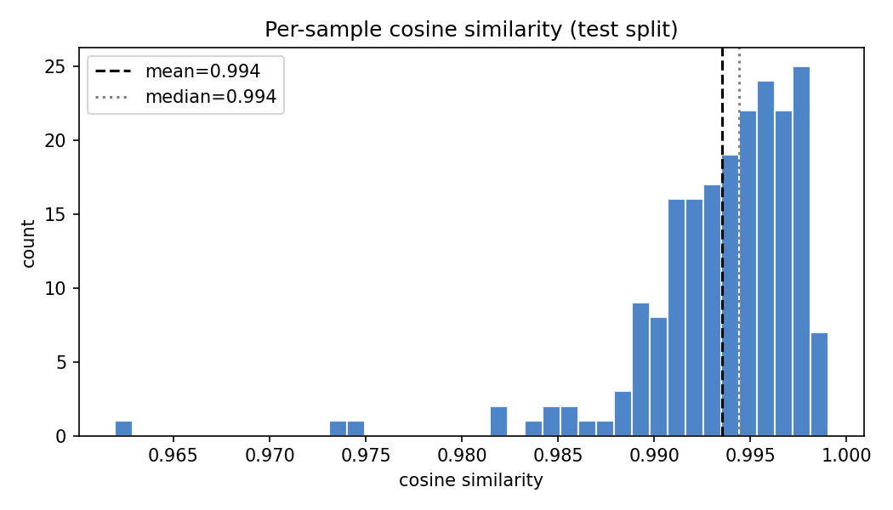
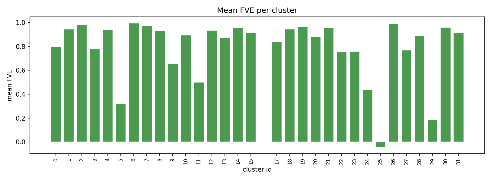
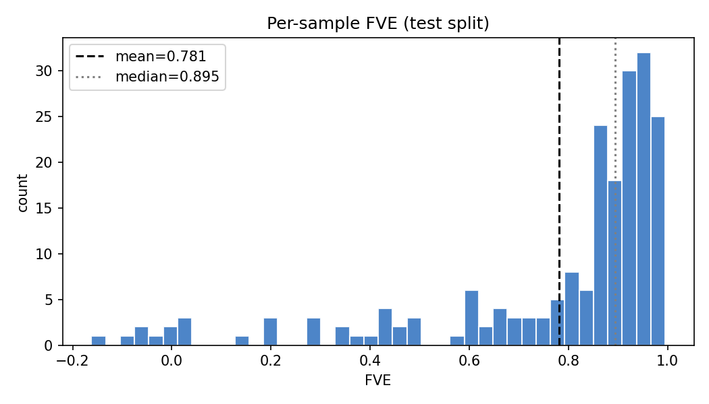
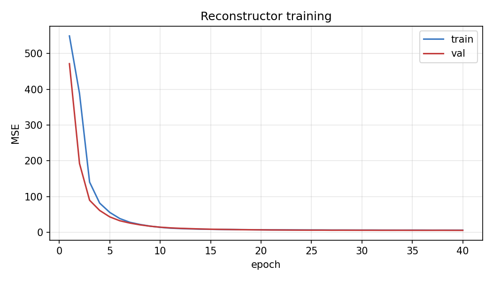

# Natural Language Autoencoder on a Small Language Model

This project reimplements and evaluates the natural language autoencoder method from the Anthropic paper on unsupervised explanations of language model activations. It was built as a response to the PhD recruitment task from the ASSERT KTH team.

The goal is not to reproduce the paper numbers on Claude. That would require frontier scale models and months of compute. The goal is to honestly implement the verbalizer and reconstructor loop on a small open source model, measure the fraction of variance explained on a held out test set, and understand where the system works and where it fails.

## What the paper does and what this project reimplements

The Anthropic paper studies autoencoders where the bottleneck is natural language rather than a numerical vector. Given a hidden state activation from a language model, two paired components are trained.

The verbalizer takes an activation and produces a short English description of what that activation represents. The reconstructor takes that English description and tries to recover the original activation vector. The quality of the round trip is measured by the fraction of variance explained.

```
FVE = 1 minus the sum of squared residuals divided by the total sum of squares
```

If the English description is informative, FVE is close to 1. If the description is empty or random, FVE is close to 0. The Anthropic paper reports 0.6 to 0.8 FVE on Claude.

This project reimplements that full loop on SmolLM2 360M Instruct with one deliberate simplification: the verbalizer here operates at cluster level rather than per activation. The paper produces one free form description per activation vector. This project groups activations into 32 clusters using KMeans and produces one description per cluster, which every member of that cluster then inherits. This simplification is meaningful and its consequences are discussed in depth in the findings section.

## Why SmolLM2 360M Instruct

SmolLM2 360M Instruct was chosen over alternatives such as Qwen 2.5 0.5B and GPT-2 for three reasons. It was released in 2024 and is genuinely open source. It fits in approximately 1.4 GB of RAM in float32, so a full 2000 sample forward pass completes in around 14 to 16 minutes on a CPU laptop. It is instruction tuned, which means the same model that produces the activations can be reused as the verbalizer without loading a second model.

If SmolLM2 fails to download, [config.yaml](config.yaml) has two fallbacks: Qwen 2.5 0.5B Instruct and GPT-2.

## Results

| metric | LLM verbalizer | shuffled control | difference |
|---|---|---|---|
| FVE global | 0.938 | -0.048 | 0.986 |
| FVE per sample median | 0.895 | -0.007 | 0.902 |
| FVE per sample mean | 0.781 | -0.058 | 0.839 |
| MSE mean | 5.78 | 97.6 | |
| cosine similarity mean | 0.994 | 0.990 | 0.004 |

The shuffled control is an identical MLP trained on the same split but with explanation to activation pairs randomly permuted. Its FVE collapses to near zero and negative. The gap of 0.986 confirms that the verbalization signal is real and not an artifact of the activation prior or the MLP capacity.

Our FVE of 0.938 is higher than the 0.6 to 0.8 reported in the Anthropic paper. The reason is not that our system is better. It is that our system is solving an easier problem. This is explained in detail below.

All result files are committed to the repository:

- [results/eval_results.json](results/eval_results.json)
- [results/control_shuffled.json](results/control_shuffled.json)
- [results/per_cluster_results.csv](results/per_cluster_results.csv)
- [results/qualitative_examples.csv](results/qualitative_examples.csv)
- [data/clusters_llm.json](data/clusters_llm.json)

## How the pipeline works

The full pipeline runs in six steps. Every script reads its settings from [config.yaml](config.yaml) so there is a single place to change hyperparameters.

```
Wikitext dataset
    01_prepare_data.py       → texts.jsonl (2000 passages)
    02_collect_activations.py → activations.npy (2000 x 960)
    03b_llm_verbalize.py     → verbalizations.jsonl
    04_train_reconstructor.py → reconstructor.pt
    05_evaluate.py            → eval_results.json + plots
    06_control_shuffled.py    → control_shuffled.json
```

## Methodology

### Data preparation

The dataset is Salesforce Wikitext (wikitext-2-raw-v1) from Hugging Face. The raw dataset has over 40000 rows. After filtering to passages between 80 and 400 characters, 2000 passages are kept and saved to [data/texts.jsonl](data/texts.jsonl).

### Activation extraction

The code in [src/activations.py](src/activations.py) extracts hidden states from a single transformer layer. The layer is chosen automatically at approximately two thirds of the model depth. For SmolLM2 360M with 32 layers, the formula `round(2/3 * 32)` gives layer 21. This heuristic comes from mechanistic interpretability research showing that mid to late layers carry the most semantic content. The extracted activations have shape 2000 by 960, stored in [data/activations.npy](data/activations.npy).

Pad token masking is applied explicitly. When computing mean pooling across token positions, the attention mask from the tokenizer is used to zero out padded positions before summing and dividing by the count of non-padded tokens. A naive mean over all positions including padding would systematically bias short passages toward the pad token embedding.

### Verbalizer

The default verbalizer is the same SmolLM2 model that the activations are extracted from. The full code is in [src/llm_verbalizer.py](src/llm_verbalizer.py). The process works as follows.

KMeans is run with 32 clusters and 10 random initialisations on the full 2000 by 960 activation matrix. For each of the 32 clusters, the 5 representative texts closest to the centroid in activation space are selected. SmolLM2 is then prompted with those 5 texts and asked to write one sentence starting with "This activation is related to". The system prompt instructs the model to be specific, avoid generic words, and output only the sentence. Decoding is greedy with a repetition penalty of 1.1. This makes 32 total LLM calls and takes approximately 7 minutes on CPU.

This is where the implementation departs from the paper. The paper verbalizes each activation individually. This implementation verbalizes each cluster once and assigns that description to every member of the cluster. The consequence is that the reconstructor can never do better than predicting the per cluster mean activation. That ceiling is what produces the high FVE, and it is the central finding of this experiment.

There is also a TF-IDF baseline verbalizer in [src/verbalizer.py](src/verbalizer.py), runnable via [scripts/03_make_verbalizations.py](scripts/03_make_verbalizations.py). It extracts top keywords from each cluster using TF-IDF with a vocabulary of 5000 terms, English stopword removal, and unigram plus bigram features. Comparing the two verbalizers is informative because the FVE barely changes between them. Both carry the same roughly 5 bits of cluster membership information. The bottleneck is the cluster ID, not the quality of the prose.

### Reconstructor

The reconstructor is in [src/reconstructor.py](src/reconstructor.py). It is a two hidden layer MLP with the architecture 384 to 512 to 1024 to 960. It uses GELU activations and 0.1 dropout after each hidden layer, with no activation or dropout on the output layer. It is trained with AdamW at a learning rate of 0.001 and weight decay of 0.00001 using MSE loss on batches of 64.

Before the MLP sees any explanation, the text string is embedded using all-MiniLM-L6-v2 from sentence transformers, which produces 384 dimensional vectors. This is one simplification compared to the Anthropic paper where the reconstructor consumes the raw string directly. Here the reconstructor is upper bounded by what MiniLM can encode from the explanation text.

The 2000 samples are split into 1600 for training, 200 for validation, and 200 for test. The split indices are saved to [data/splits.json](data/splits.json) so that every evaluation script uses exactly the same held out partition. Training runs for up to 50 epochs with early stopping at patience 7.

### Metrics

The metrics are implemented in [src/metrics.py](src/metrics.py) and tested in [tests/test_metrics.py](tests/test_metrics.py). The global FVE uses the test set mean activation as the baseline, which matches the standard R squared definition. Global FVE computes residuals and total variance across all samples and all 960 dimensions at once. Per sample FVE uses the same global mean as the baseline so that individual scores are comparable to the global number.

The implementation is tested against 12 known answer cases. Perfect reconstruction gives FVE of 1. Predicting the mean gives FVE of 0. Doing worse than the mean gives negative FVE. It agrees with scikit-learn R squared in one dimension. Zero variance inputs return NaN rather than a misleading number. All 12 tests pass.

## Findings

### Finding 1: high FVE but most of it is cluster identity

The headline FVE of 0.938 sounds impressive but without the shuffled control it would be uninterpretable. The shuffled control trains an identical MLP on the same split with explanation to activation pairs randomly permuted. Its FVE collapses to -0.048. The gap of 0.986 confirms the verbalization signal is real.

The caveat is that the verbalizer encodes a categorical cluster ID. With 32 clusters that is about 5 bits. Since every sample in a cluster receives the same explanation, the reconstructor can only ever predict the per cluster mean activation. The high FVE is mostly a statement about how separable the 32 clusters are in activation space, not about how rich or meaningful the text descriptions are.

Replacing the LLM verbalizer with the crude TF-IDF baseline barely changes the FVE. The bottleneck is the cluster ID, not the language.

### Finding 2: cosine similarity is nearly useless in this setup

Mean pooled SmolLM2 activations all live in a narrow cone in high dimensional space. The shuffled control reaches cosine similarity of 0.990, which is almost the same as the real run at 0.994, even though the shuffled FVE is -0.048. FVE and MSE are the informative metrics here. Cosine alone tells you nothing meaningful in this regime.



The histogram above shows both the real and shuffled cosine distributions sitting on top of each other above 0.98. A paper that reported only cosine similarity would have no way to distinguish the real run from the shuffled control. This is the kind of subtle methodological issue that could quietly bias an interpretability paper.

### Finding 3: per cluster heterogeneity is the most interesting result



Most clusters reconstruct cleanly with FVE between 0.80 and 0.99 but a few are catastrophically bad. There are two distinct failure modes in the data.

The first is incoherent clusters. Cluster 25 is the clearest example. Its mean FVE across 8 test samples is -0.045, meaning the reconstructor does worse than simply predicting the mean activation. Its cosine similarity is 0.995, which looks fine and would mislead any reader who stopped there. The LLM explanation for cluster 25 reads: "This activation is related to the themes of youth development and mentorship found in the passages, particularly in the examples where Fey's involvement in organizations such as Autism Speaks highlights her commitment to supporting individuals with disabilities." The representative texts that generated that explanation included a passage about Tina Fey's childhood and a passage about a church parish transfer in 1910. The test samples assigned to cluster 25 included a sentence about Lithuanian national anthem legislation, a sentence about bobcats and coyotes, and a sentence about a Yiddish television character. None of these share any semantic content. KMeans grouped them because their activation vectors happened to be geometrically close in 960 dimensional space. The LLM latched onto the Fey passage and produced a description that is wrong for every other member of the cluster. No single sentence can correctly describe an incoherent cluster, and the negative FVE is the direct result.

The second failure mode is small noisy clusters. Clusters 29 and 5 perform poorly with FVE of 0.18 and 0.32 respectively. Both have small test populations where within cluster variance is high relative to the centroid distance. Even a semantically reasonable explanation cannot recover a tight mean activation when the cluster members are scattered far from the centroid.

The FVE distribution across clusters is the clearest signal in the whole experiment. It shows exactly where KMeans is working and where it is not. This motivates moving away from KMeans categorical verbalizers in any serious follow up work.

### Finding 4: distributions matter more than means



The per sample FVE distribution is left skewed. A long tail of poorly reconstructed samples from incoherent and small noisy clusters pulls the mean below the median. The median is 0.895 while the mean is 0.781. That gap of 0.114 tells you the distribution is not symmetric. Any paper that reports only a global FVE number without the distribution is telling an incomplete story about its system.

The training curve shows healthy convergence with no signs of overfitting.



## Why our FVE is higher than the paper

The paper reports 0.6 to 0.8 FVE on Claude. Our number is 0.938. The reason is not that our system is better. It is that our system is solving an easier problem.

The paper verbalizer produces free form text per activation. Our verbalizer produces one of 32 fixed sentences. A categorical channel with 32 classes can be nearly perfectly inverted by learning a lookup table of 32 cluster mean activations. That is a much easier inversion problem than recovering activations from free form prose.

There is also a mild clustering leakage. KMeans fits its centroids on all 2000 samples including the 200 test samples. The reconstructor itself never trains on test data, which is the critical boundary. But cluster membership is computed globally so a test sample inherits the same explanation as nearby training samples. This makes our FVE a slight optimistic upper bound on what a clean pipeline would report.

The force pushing our number down compared to the paper is that SmolLM2 360M is a much smaller and less structured model than Claude, and mean pooling is a lossy summary of token level information. Neither of these effects matters much in the 32 cluster categorical regime, but both would matter substantially if the verbalizer were switched to per sample free form generation.

The infrastructure to run per sample verbalization exists in [scripts/03b_llm_verbalize.py](scripts/03b_llm_verbalize.py) using the per sample mode flag, which fits a finer grained KMeans and makes one LLM call per sample rather than per cluster. Running it at full scale would take approximately 6 hours of CPU generation for 2000 samples and was not done here due to compute constraints.

## Limitations

The bottleneck is categorical not textual. The verbalizer assigns one of 32 fixed sentences per sample. The high FVE is primarily the cost of inverting a 5 bit code, not the cost of inverting free prose. The per sample mode exists in the codebase but was not run at scale.

The reconstructor consumes a sentence embedding, not the raw text. MiniLM with 384 dimensions caps the information channel between the explanation and the reconstructor. A string consuming reconstructor using a model such as T5 with a linear projection head would be a stronger follow up.

Mean pooled hidden states are a coarse representation. Per token activations carry more information but require a different and more complex reconstruction target with variable output dimensions.

KMeans is a weak clustering algorithm on raw hidden states. It groups topically unrelated texts together when their activation vectors are geometrically close, as cluster 25 demonstrates concretely. That is a failure of the algorithm, not the language model used for verbalization.

2000 samples is a modest dataset. It is enough for a reliable baseline but too small to make claims about behaviour at scale.

## How to run this project

### Setup

```bash
git clone https://github.com/YOUR_USERNAME/natural-language-autoencoder-small
cd natural-language-autoencoder-small
pip install -r requirements.txt
```

Python 3.10 or higher is required. This was verified on Python 3.14 with Windows 11 on CPU. All models and datasets download automatically from Hugging Face on the first run. No API keys or paid services are required.

### Run the full pipeline

On Windows:

```powershell
.\run_all.ps1
```

On Linux, Mac, or Google Colab:

```bash
bash run_all.sh
```

Total runtime on a CPU laptop is approximately 25 to 28 minutes. On a single GPU it takes approximately 3 to 4 minutes.

### Run each step individually

```bash
python scripts/01_prepare_data.py
python scripts/02_collect_activations.py
python scripts/03b_llm_verbalize.py
python scripts/04_train_reconstructor.py
python scripts/05_evaluate.py
python scripts/06_control_shuffled.py
```

To use the TF-IDF baseline verbalizer instead of the LLM verbalizer, run script 03 in place of 03b:

```bash
python scripts/03_make_verbalizations.py
```

To run the unit tests:

```bash
python -m pytest tests/
```

### Streamlit dashboard

After the pipeline has finished:

```bash
streamlit run app/streamlit_app.py
```

Open a browser at http://localhost:8501. The dashboard has seven pages: overview, metrics and control comparison, training curve, result plots, qualitative examples, cluster explanations, and a custom text demo where any sentence can be typed to see live activation extraction, cluster assignment, and reconstruction.

### Repository layout

```
natural-language-autoencoder-small/
    config.yaml          run_all.ps1   run_all.sh
    scripts/
        01_prepare_data.py
        02_collect_activations.py
        03_make_verbalizations.py
        03b_llm_verbalize.py
        04_train_reconstructor.py
        05_evaluate.py
        06_control_shuffled.py
    src/
        activations.py   verbalizer.py    llm_verbalizer.py
        reconstructor.py metrics.py       model_utils.py
        data.py          plotting.py      utils.py
    tests/test_metrics.py
    data/        checkpoints/    results/    app/
```

## What is interesting beyond the core numbers

The shuffled explanations control was not in the original task brief but it was essential for interpreting the FVE result. Without it, a high FVE has no calibration. It could mean the explanations carry signal, or it could mean the activations live on a low rank manifold that the MLP recovers from any input regardless of content. The control answers that question clearly.

The cosine similarity finding is the kind of issue that could quietly bias an interpretability paper. Any reader who only checked cosine similarity would conclude both the real and shuffled runs are equally good. FVE and MSE tell the true story.

The cluster 25 failure case is the most instructive qualitative result. It shows concretely that clustering quality dominates verbalizer quality in this setup. The LLM cannot rescue an incoherent cluster because no single sentence can correctly describe texts that have nothing in common. Improving the clustering step would do more for FVE than improving the language generation step.

## Acknowledgments

Thanks to Anthropic for the natural language autoencoders paper that this project is based on. Thanks to the ASSERT KTH team for the task brief. Thanks to Hugging Face for the transformers, datasets, and sentence transformers libraries.

## License

MIT
